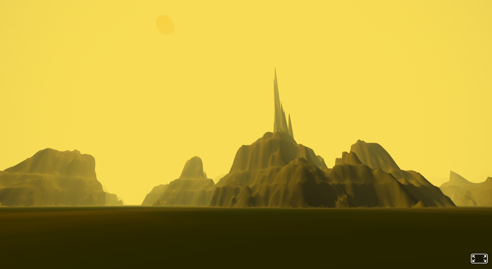

# map-generator

<table>
  <tr>
    <td></td>
    <td></td>
    <td></td>
  </tr>
  <tr>
    <td></td>
    <td></td>
    <td></td>
  </tr>
</table>

## chunk-generator Component

The `chunk-generator` component is an A-Frame component designed to generate terrain chunks dynamically. This component allows for the creation of large, procedurally generated terrains with various customizable parameters.

### Schema Properties

- **chunkSize**: 
  - **Type**: `int`
  - **Default**: `50`
  - **Description**: The size of each terrain chunk.

- **viewDistance**: 
  - **Type**: `number`
  - **Default**: `200`
  - **Description**: The distance within which chunks are generated and visible.

- **terrainScale**: 
  - **Type**: `number`
  - **Default**: `100`
  - **Description**: The scale of the terrain features.

- **noiseOctaves**: 
  - **Type**: `int`
  - **Default**: `8`
  - **Description**: The number of octaves used in the noise function for terrain generation.

- **noisePersistence**: 
  - **Type**: `number`
  - **Default**: `0.5`
  - **Description**: The persistence value for the noise function, affecting the amplitude of each octave.

- **noiseLacunarity**: 
  - **Type**: `number`
  - **Default**: `2.0`
  - **Description**: The lacunarity value for the noise function, affecting the frequency of each octave.

- **randomSeed**: 
  - **Type**: `int`
  - **Default**: `0`
  - **Description**: The seed value for random number generation, ensuring reproducible terrain.

- **worldOffset**: 
  - **Type**: `vec2`
  - **Default**: `{ x: 0, y: 0 }`
  - **Description**: The offset applied to the world coordinates.

- **heightScale**: 
  - **Type**: `number`
  - **Default**: `30.0`
  - **Description**: The scale of the terrain height.

- **heightCurve**: 
  - **Type**: `string`
  - **Default**: `'[[0.46,0],[0.48,0.05],[0.5,0.1],[0.6,0.2],[0.7,0.4],[0.8,0.5],[0.85,0.6],[0.9,0.7],[1,1]]'`
  - **Description**: A JSON string representing the height curve, which defines how height values are interpolated.

- **terrainRegions**: 
  - **Type**: `string`
  - **Default**: `'[{"name":"WaterDeep","height":0.2,"color":"#0048FF"},{"name":"WaterShallow","height":0.46,"color":"#0087FF"},{"name":"Sand","height":0.5,"color":"#c2b280"},{"name":"Grass1","height":0.6,"color":"#348C31"},{"name":"Mud","height":0.7,"color":"#70543e"},{"name":"Grass2","height":0.8,"color":"#1F6420"},{"name":"Snow","height":0.9,"color":"#FFFFFF"}]'`
  - **Description**: A JSON string defining the different terrain regions, their heights, and colors.

- **detailLevel**: 
  - **Type**: `string`
  - **Default**: `'[[100,0],[200,1]]'`
  - **Description**: A JSON string defining the detail levels for the terrain.

- **normalizeMethod**: 
  - **Type**: `string`
  - **Default**: `'global'`
  - **Description**: The method used to normalize the terrain heights.

- **applyFalloff**: 
  - **Type**: `boolean`
  - **Default**: `false`
  - **Description**: Whether to apply a falloff effect to the terrain.

- **normalizePostFalloff**: 
  - **Type**: `boolean`
  - **Default**: `false`
  - **Description**: Whether to normalize the terrain heights after applying the falloff effect.

- **renderMode**: 
  - **Type**: `string`
  - **Default**: `'mesh'`
  - **Description**: The rendering mode for the terrain (e.g., 'mesh').

- **textureFilter**: 
  - **Type**: `string`
  - **Default**: `'linear'`
  - **Description**: The texture filtering method.

- **enablePhysics**: 
  - **Type**: `boolean`
  - **Default**: `false`
  - **Description**: Whether to enable physics for the terrain chunks.

- **updateInterval**: 
  - **Type**: `number`
  - **Default**: `100`
  - **Description**: The interval (in milliseconds) at which the terrain is updated.

### Usage

To use the `chunk-generator` component, add it to an A-Frame entity in your HTML:

```html
<a-entity chunk-generator="chunkSize: 100; viewDistance: 300;"></a-entity>
```
